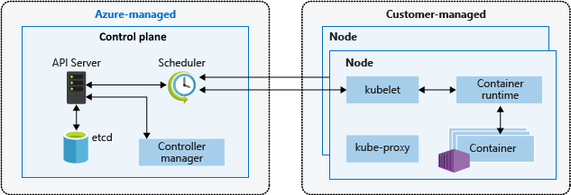

# Getting Started

## Azure Kubernetes Service 

Azure Kubernetes Service (AKS) simplifies deploying a managed Kubernetes cluster in Azure by offloading the operational overhead to Azure. As a hosted Kubernetes service, Azure handles critical tasks, like health monitoring and maintenance. Since Kubernetes masters are managed by Azure, you only manage and maintain the agent nodes. Thus, AKS is free; you only pay for the agent nodes within your clusters, not for the masters.

Application development continues to move toward a container-based approach, increasing our need to orchestrate and manage resources. As the leading platform, Kubernetes provides reliable scheduling of fault-tolerant application workloads. Azure Kubernetes Service (AKS), a managed Kubernetes offering, further simplifies container-based application deployment and management.

<figure><figcaption>
Kubernetes Core Components Source:Kubernetes.io
</figcaption></figure>

### What is Kubernetes? 

A Kubernetes cluster consists of a set of worker machines, called [nodes](https://kubernetes.io/docs/concepts/architecture/nodes/), that run containerized applications. Every cluster has at least one worker node.

The worker node(s) host the [Pods](https://kubernetes.io/docs/concepts/workloads/pods/) that are the components of the application workload. The [control plane](https://kubernetes.io/docs/reference/glossary/?all=true#term-control-plane) manages the worker nodes and the Pods in the cluster. In production environments, the control plane usually runs across multiple computers and a cluster usually runs multiple nodes, providing fault-tolerance and high availability.

Kubernetes is a rapidly evolving platform that manages container-based applications and their associated networking and storage components. Kubernetes focuses on the application workloads, not the underlying infrastructure components. Kubernetes provides a declarative approach to deployments, backed by a robust set of APIs for management operations.

You can build and run modern, portable, microservices-based applications, using Kubernetes to orchestrate and manage the availability of the application components. Kubernetes supports both stateless and stateful applications as teams progress through the adoption of microservices-based applications.

As an open platform, Kubernetes allows you to build your applications with your preferred programming language, OS, libraries, or messaging bus. Existing continuous integration and continuous delivery (CI/CD) tools can integrate with Kubernetes to schedule and deploy releases.

AKS provides a managed Kubernetes service that reduces the complexity of deployment and core management tasks, like upgrade coordination. The Azure platform manages the AKS control plane, and you only pay for the AKS nodes that run your applications.

### Control Plane Components 

The control plane's components make global decisions about the cluster (for example, scheduling), as well as detecting and responding to cluster events (for example, starting up a new [pod](https://kubernetes.io/docs/concepts/workloads/pods/) when a deployment's `replicas` field is unsatisfied).

Control plane components can be run on any machine in the cluster. However, for simplicity, set up scripts typically start all control plane components on the same machine, and do not run user containers on this machine. See [Creating Highly Available clusters with kubeadm](https://kubernetes.io/docs/setup/production-environment/tools/kubeadm/high-availability/) for an example control plane setup that runs across multiple machines.

#### kube-apiserver 

The API server is a component of the Kubernetes [control plane](https://kubernetes.io/docs/reference/glossary/?all=true#term-control-plane) that exposes the Kubernetes API. The API server is the front end for the Kubernetes control plane.

The main implementation of a Kubernetes API server is [kube-apiserver](https://kubernetes.io/docs/reference/generated/kube-apiserver/). kube-apiserver is designed to scale horizontally—that is, it scales by deploying more instances. You can run several instances of kube-apiserver and balance traffic between those instances.

#### etcd 

Consistent and highly-available key value store used as Kubernetes' backing store for all cluster data.

If your Kubernetes cluster uses etcd as its backing store, make sure you have a [back up](https://kubernetes.io/docs/tasks/administer-cluster/configure-upgrade-etcd/#backing-up-an-etcd-cluster) plan for those data.

You can find in-depth information about etcd in the official [documentation](https://etcd.io/docs/).

#### kube-scheduler 

Control plane component that watches for newly created [Pods](https://kubernetes.io/docs/concepts/workloads/pods/) with no assigned [node](https://kubernetes.io/docs/concepts/architecture/nodes/), and selects a node for them to run on.

Factors taken into account for scheduling decisions include: individual and collective resource requirements, hardware/software/policy constraints, affinity and anti-affinity specifications, data locality, inter-workload interference, and deadlines.

#### kube-controller-manager 

Control plane component that runs [controller](https://kubernetes.io/docs/concepts/architecture/controller/) processes.

Logically, each [controller](https://kubernetes.io/docs/concepts/architecture/controller/) is a separate process, but to reduce complexity, they are all compiled into a single binary and run in a single process.

Some types of these controllers are:

* Node controller: Responsible for noticing and responding when nodes go down.
* Job controller: Watches for Job objects that represent one-off tasks, then creates Pods to run those tasks to completion.
* Endpoints controller: Populates the Endpoints object (that is, joins Services & Pods).
* Service Account & Token controllers: Create default accounts and API access tokens for new namespaces.

#### cloud-controller-manager 

A Kubernetes [control plane](https://kubernetes.io/docs/reference/glossary/?all=true#term-control-plane) component that embeds cloud-specific control logic. The cloud controller manager lets you link your cluster into your cloud provider's API, and separates out the components that interact with that cloud platform from components that only interact with your cluster.

The cloud-controller-manager only runs controllers that are specific to your cloud provider. If you are running Kubernetes on your own premises, or in a learning environment inside your own PC, the cluster does not have a cloud controller manager.

As with the kube-controller-manager, the cloud-controller-manager combines several logically independent control loops into a single binary that you run as a single process. You can scale horizontally (run more than one copy) to improve performance or to help tolerate failures.

The following controllers can have cloud provider dependencies:

* Node controller: For checking the cloud provider to determine if a node has been deleted in the cloud after it stops responding
* Route controller: For setting up routes in the underlying cloud infrastructure
* Service controller: For creating, updating and deleting cloud provider load balancers

### Kubernetes cluster architecture 

A Kubernetes cluster is divided into two components:

* _Control plane_: provides the core Kubernetes services and orchestration of application workloads.
* _Nodes_: run your application workloads.

<figure><figcaption>
Azure Managed-Control Plane and Worker Node for application workloads
</figcaption></figure>

### Control plane 

When you create an AKS cluster, a control plane is automatically created and configured. This control plane is provided at no cost as a managed Azure resource abstracted from the user. You only pay for the nodes attached to the AKS cluster. The control plane and its resources reside only on the region where you created the cluster.

The control plane includes the following core Kubernetes components:

| Component                 | Description                                                                                                                                                                    |
| ------------------------- | ------------------------------------------------------------------------------------------------------------------------------------------------------------------------------ |
| _kube-apiserver_          | The API server is how the underlying Kubernetes APIs are exposed. This component provides the interaction for management tools, such as `kubectl` or the Kubernetes dashboard. |
| _etcd_                    | To maintain the state of your Kubernetes cluster and configuration, the highly available _etcd_ is a key value store within Kubernetes.                                        |
| _kube-scheduler_          | When you create or scale applications, the Scheduler determines what nodes can run the workload and starts them.                                                               |
| _kube-controller-manager_ | The Controller Manager oversees a number of smaller Controllers that perform actions such as replicating pods and handling node operations.                                    |
